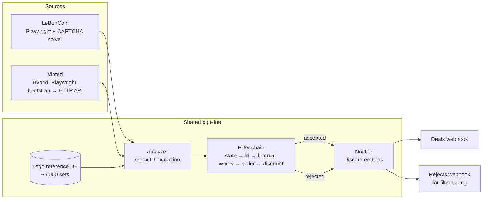

# Lego Scraper Bot

> Discord bot that continuously scans **LeBonCoin** and **Vinted** for
> underpriced Lego sets and posts real-time alerts with rich embeds:
> matched set, reference price, discount %, condition, seller info.


<!-- Add a demo GIF here once recorded:

-->

---

## Why

Used Lego sets on French resale sites are mispriced constantly. Most sellers
have no idea what their set is worth, while collectors hunt for discounts
across **LeBonCoin** (Craigslist-style classifieds) and **Vinted**
(C2C marketplace).

I built this bot to flip the asymmetry: scan both platforms 24/7, cross-check
every listing against a reference DB of ~6,000 Lego sets, and push only the
real deals to a Discord channel. From a 100-second scan loop to a webhook
embed in under 5 seconds.

The architectural challenge was that the two platforms behave nothing alike:
LeBonCoin has no API and ships an aggressive Datadome challenge (slider
CAPTCHA, headless detection), while Vinted exposes a JSON API but requires a
fresh bearer token from a browser session. The bot handles both behind one
shared analysis pipeline.

---

## Architecture



**Components**

- **Scrapers** — per-platform fetchers. LeBonCoin uses a persistent Chromium
  instance with a Datadome slider auto-solver; Vinted uses a one-shot
  Playwright bootstrap to extract a bearer token, then pure HTTP requests.
- **Analyzer** — regex-extracts every 4–7 digit number from title +
  description, intersects with a 6,000-set Lego reference DB, computes
  discount vs reference price.
- **Filter chain** — ordered, configurable: condition state → ID validity →
  banned French keywords ("incomplet", "manque", "vrac"…) → seller quality →
  discount range. First rejection short-circuits.
- **Notifier** — two Discord webhooks per bot: one for accepted deals (rich
  embed with image, price comparison, seller profile link), one for
  rejections (compact embed used to tune filters).

---

## Stack

Python 3.11+ · Playwright · Requests · PyYAML · Discord webhooks

---

## Quick start

```bash
git clone https://github.com/<your-username>/lego-scraper-bot.git
cd lego-scraper-bot

python -m venv .venv
source .venv/bin/activate          # Windows: .venv\Scripts\activate
pip install -r requirements.txt
playwright install chromium

# Configure each bot (edit the webhook URLs and search text)
cp bots/vinted/config.yaml.example     bots/vinted/config.yaml
cp bots/leboncoin/config.yaml.example  bots/leboncoin/config.yaml

# Run either bot
python scripts/run_vinted.py
python scripts/run_leboncoin.py
```

The first LeBonCoin launch will open a visible browser window — solve the
CAPTCHA once if shown; the session is then persisted across cycles.

---

## Configuration

Each bot has its own `config.yaml` (see the `.example` file for the full
schema). The most useful knobs:

| Section | Key | Purpose |
|---|---|---|
| `global` | `loop_delay` / `jitter` | Polite-polling interval in seconds |
| `global` | `backoff_start` / `backoff_max` | Exponential backoff on errors |
| `filters` | `priority` | Order in which filters run; first rejection stops |
| `filters.discount` | `min` / `max` | Accepted discount range vs reference price |
| `vinted` / `leboncoin` | `search_text` | Search query (e.g. `lego star wars`) |
| `vinted` / `leboncoin` | `webhook` | Discord webhook for accepted listings |
| `vinted` / `leboncoin` | `webhook_reject` | Discord webhook for rejected listings |
| `*.deep_scan_every` | | Cycles between multi-page deep scans |

---

## Learnings

Things this project forced me to figure out:

- **Anti-bot is a moving target.** LeBonCoin's Datadome challenge changes
  selectors quietly. The current slider solver uses easing + random Y jitter
  to look human; this lasts until it doesn't. The right answer long-term is
  rotating residential proxies + a CAPTCHA-solving service, but for personal
  use a persistent browser + occasional manual solve is enough.
- **Vinted's "API" isn't public.** The bearer token is bound to a session
  cookie, both expire fast, and the only way to grab them reliably is a
  short Playwright bootstrap. The bot caches them to disk and only
  re-bootstraps on 401.
- **Filter ordering matters more than filter quality.** Putting `state`
  before `discount` cut Discord noise by ~80% in practice, because most
  rejects were trivially-disqualified listings the discount filter had no
  business processing.
- **Polite polling beats parallelism.** Both platforms throttle aggressively.
  A single ~90s polling loop with light jitter outperforms anything more
  ambitious and stays well under any reasonable rate limit.

---

## Limitations & roadmap

- LeBonCoin bot uses `pyautogui.hotkey("win", "down")` to minimize the
  visible browser. On macOS/Linux this is silently skipped — the window
  stays visible (functional but ugly).
- No automated test suite. The scraping layer is the most fragile part and
  the hardest to test without recording fixtures — that's the obvious next step.
- The reference Lego DB is a static JSON snapshot. Auto-refreshing it from
  Brickset / BrickEconomy is a follow-up.
- Per-platform webhook URLs still live in `config.yaml`. Migrating them to
  env vars (and reading from `.env`) is on the roadmap.
- No retry/dedup for Discord webhook failures beyond what `requests` gives.

---

## License

MIT — see [LICENSE](LICENSE).
